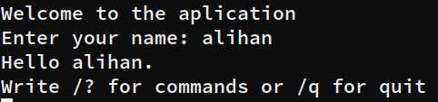
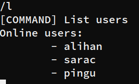
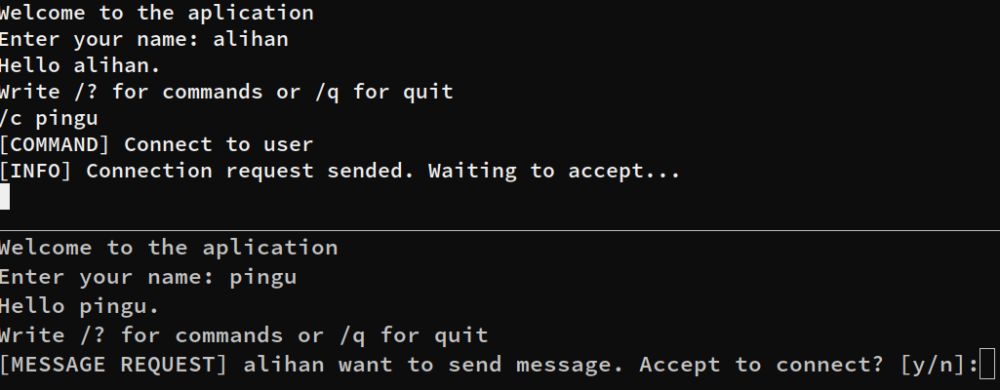

# C Chat Server

This is socket and multi-thread proof of concept example.

> [!WARNING]
> This project is under development. DON'T USE in real world!

**Table of Contents**:

- [setup](#setup-code)
  - [install](#install-source-code)
  - [run](#run-code)
- [client usage](#application-usage)
  - [commands](#commands)
    - [help](#help)
    - [list users](#l---list-users)
    - [connect to user](#c---connect-to-other-user)
    - [command history](#h---command-history)
    - [broadcast message](#b---broadcast-a-message)
    - [quit](#q---quit-from-application)
- [structure of project](#structure-of-project)
- [contributing](#contributing)
- [license](#license)

## Setup Code

### Install Source Code

Clone this project using GIT

```bash
git clone git@github.com:saracalihan/c-socket-chat.git c-server
```

Go into directory

```bash
cd c-server
```

### Run Code

**Defines**:

You can change those variables what you want. Add `-D<variable-name>=<value>` to `FLAGS` variables at `makefile`

> Example: `-DPORT=8080`

`PORT`: Server listen this port. Default value is `3000`

`MAX_CONN`: Maximmum connection count. Default value is `10`

**Compile and Run:**

`make` command compile `src/server.c` file to `bin` folder then run `bin/program` executable.

Execute `./bin/program` binary when you want to listen server.

## Application Usage

> First of all, you need to TCP client program like netcat or PacketSender for connecting to the application.

Run the server executable, then connect it with tcp client. For example, this is Linux netcat usage:

```bash
./bin/program
```

After this command you will see that output:


> If `PORT` is already using, the system increase it and try again and again to finding avaible port.

> In this example, 3000 is already using and 3001 is availeble

Open a new terminal and create tcp connection:

```bash
netcat localhost 3001
```

After the connection server ask a unique username.

> If username is taken server ask again.



Now, you will able to run commands.

If you have a typo in your command or you send wrong command don't afraid. Server check it and send error and usage message like this:

_On invalid command_:


_On typo_:


When a user connect to server, server log thread number, file descriptor and username like this:


### Commands

#### /? - Help

This command return a basic usage message.


#### /l - List Users

This command returns a list of users who have contacted the server including you.



In this example, you are 'alihan' and we have 2 other user.

#### /c - Connect to Other User

This command is first step of sending private message to other users. You should to pass username wantted to connect.
If you don't know or remember the user's username you can use list command.

`/c <username>`



In this example, if pingu send `y`, alihan and pingu start to chating else if pingu send `n` system send a unwanted connection message to alihan. In other latters pingu see "wrong answer message".

#### /h - Command History

This command return your command history.


In this example, the user send `/?`, `asdasd`, `/ASD`, `/l` and `/h` commands.

#### /b - Broadcast a Message

This command send your message to all users including you.

`/b <message>`


#### /q - Quit From Application

This command close connection between you and server.


## Structure of Project

### File Structure

```bash
.
├── bin # executables folder
│   └── program # main executable
├── images
├── includes # header files
│   ├── commands.h
│   ├── commons.h # common structs, types and functions
│   ├── dynamicarray.h
│   └── user.h
├── LICENSE # MIT license
├── makefile
├── obj # Object folder, object files compiles here
├── README.md
└── src # source folder, implementations of headers
    ├── commands.c
    ├── commons.c
    ├── server.c
    └── user.c
```

## Contributing

This project accepts the open source and free software mentality in its main terms. Development and distribution are free within the framework of the rules specified in the license section, BUT the course and mentality of the project depends entirely on my discretion. Please respect this mentality and contributing rules.

```js
// TODO:CONTRIBUTING.md
```

## License

This project is under the [MIT](./LICENSE) license.
